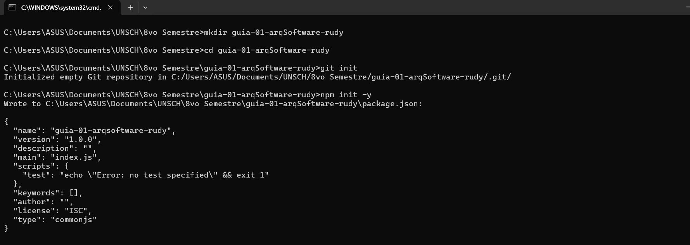
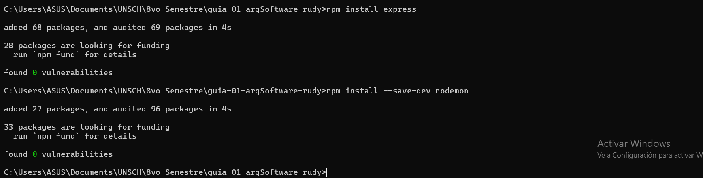
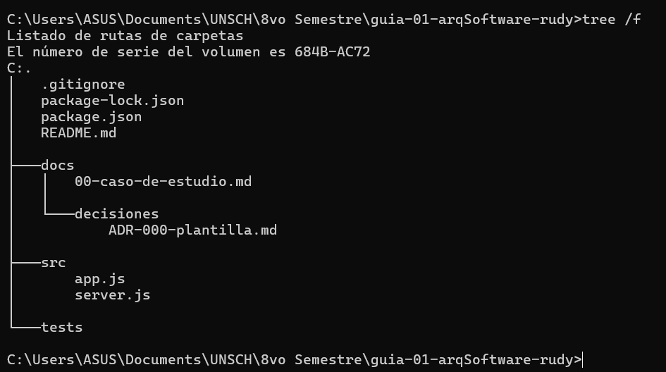

# guia-01-arqSoftware

| | |
|---|---|
| **Estudiante** | Rudy Gómez Bellido |
| **Curso** | Arquitectura de Software (IS-488) |
| **Docente** | Ing. Lizbeth Jaico Quispe |
| **Semestre** | 2026-II |

---

## Descripción del curso

Arquitectura de Software (IS-488) es un curso enfocado en el diseño de sistemas desde una perspectiva de alto nivel: cómo se organizan los componentes de una aplicación, cómo se comunican entre sí, y qué decisiones estructurales sostienen un proyecto de software a lo largo del tiempo. Se abordan patrones arquitectónicos, separación de responsabilidades, escalabilidad, mantenibilidad y el uso de documentación técnica como los ADR (Architecture Decision Records) para registrar decisiones de diseño.

## Expectativas del curso

Espero fortalecer mi criterio para tomar decisiones de diseño de software con fundamento técnico, comprender cuándo y por qué aplicar distintos patrones arquitectónicos según el contexto de un proyecto, y desarrollar el hábito de documentar decisiones técnicas de forma clara y trazable.

---

## Evidencias

### Paso 01 — Inicialización del proyecto

Se creó la carpeta del proyecto, se inicializó el repositorio Git y el proyecto Node.js, y se instalaron las dependencias `express` (producción) y `nodemon` (desarrollo).



**Figura 1.** Comandos `mkdir`, `cd`, `git init` y `npm init -y`, mostrando la generación del archivo `package.json`.



**Figura 2.** Instalación de `express` como dependencia de producción y de `nodemon` como dependencia de desarrollo.

### Paso 02 — Estructura de carpetas

Se organizó el proyecto separando responsabilidades desde el inicio: `docs/` para documentación, `src/` para el código fuente, y `tests/` reservada para pruebas futuras.



**Figura 3.** Resultado del comando `tree /f`, mostrando la estructura final del proyecto: `docs/`, `docs/decisiones/`, `src/`, `tests/`, junto con `package.json`, `package-lock.json` y `.gitignore`.

---

## Estructura del proyecto

```
guia-01-arqSoftware/
├── docs/
│   ├── 00-caso-de-estudio.md
│   └── decisiones/
│       └── ADR-000-plantilla.md
├── src/
│   ├── app.js
│   └── server.js
├── tests/
├── .gitignore
├── README.md
├── package.json
└── package-lock.json
```